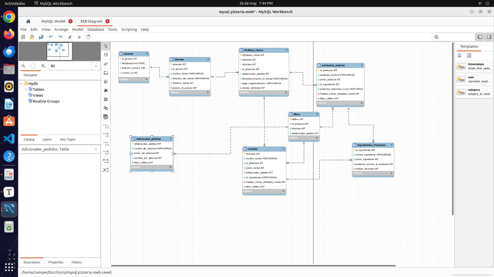

## Investigación: Bases de Datos NoSQL y MongoDB

### ¿Qué es una base de datos NoSQL?

Una base de datos NoSQL (Not Only SQL) es un tipo de base de datos que permite almacenar y recuperar datos de forma no relacional. Se caracteriza por su flexibilidad, escalabilidad y rendimiento, ya que no requiere un esquema fijo y puede trabajar con grandes volúmenes de datos distribuidos. Existen varios tipos de bases de datos NoSQL: documentales, clave-valor, columnares y de grafos.

---

### ¿Qué es MongoDB?

MongoDB es una base de datos NoSQL de tipo documental. Almacena la información en documentos con formato BSON (una versión binaria de JSON), lo cual permite una estructura flexible y dinámica. Es ampliamente utilizada en aplicaciones modernas por su facilidad para trabajar con datos complejos, anidados y sin una estructura fija.

---

### ¿Qué diferencia hay entre una base de datos relacional (como MySQL) y una base de datos documental como MongoDB?

| Característica         | MySQL (Relacional)                         | MongoDB (Documental)                        |
|------------------------|--------------------------------------------|---------------------------------------------|
| Modelo de datos        | Tablas con filas y columnas                | Documentos tipo JSON dentro de colecciones  |
| Esquema                | Estricto (definido por adelantado)         | Flexible (puede variar entre documentos)    |
| Relaciones             | Llaves primarias y foráneas                | Embebidas o referencias entre documentos    |
| Lenguaje de consultas  | SQL                                        | MongoDB Query Language (similar a JSON)     |
| Rendimiento con datos anidados | Menor, requiere JOINs             | Mayor, permite anidar datos directamente    |

---

### ¿Qué son documentos y colecciones en MongoDB?

- **Documento:** Es la unidad básica de almacenamiento en MongoDB, representado como un objeto JSON (por ejemplo, una pizza, un cliente o un pedido). Cada documento puede tener una estructura única, y puede contener datos simples o anidados.

- **Colección:** Es un conjunto de documentos relacionados, similar a una tabla en una base de datos relacional. Por ejemplo, podrías tener una colección `pizzas`, otra llamada `clientes`, y otra `pedidos`.

---

## Vista de pedido


## 4. Reflexión

### ¿Qué fue lo más difícil de imaginar sin tablas?

Lo más difícil fue acostumbrarnos a no pensar en relaciones con llaves foráneas ni estructuras fijas. En bases de datos relacionales como MySQL, todo se basa en la normalización y las conexiones entre tablas. En cambio, con MongoDB, tuvimos que aprender a estructurar la información en documentos independientes o embebidos, y eso nos hizo repensar cómo organizar los datos.

### ¿Qué nos gustó del enfoque con documentos?

Nos gustó la flexibilidad para crear documentos que pueden tener estructuras distintas, anidar objetos y listas sin necesidad de múltiples tablas. También fue interesante ver cómo podemos guardar toda la información relevante de un pedido o producto dentro de un solo documento, lo que facilita el acceso y la lectura directa.

### ¿Qué dudas nos surgieron al pensar en este nuevo tipo de base de datos?

Tuvimos dudas sobre cómo controlar la integridad de los datos sin claves foráneas, cómo manejar actualizaciones si los datos están embebidos, y qué tan eficiente es este modelo cuando hay gran volumen de datos o muchas relaciones entre entidades. También nos preguntamos cómo manejar el autoincremento de identificadores sin SQL ya que mongo no posee el autoincremento de id.


> Ejemplo de documento en MongoDB:
```json
{
  "nombre": "Pizza Hawaiana",
  "ingredientes": ["jamón", "piña", "queso"],
  "precio": 28000,
  "tamanio": "mediana"
}